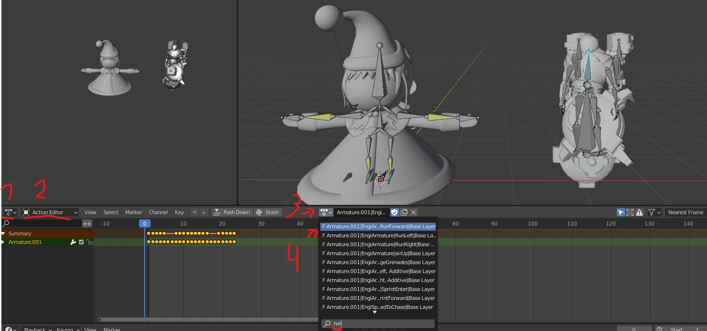

# Shifty's Character Skin Import Guide
Version 0.5 

# Intro
The purpose of this guide is to describe how to take a custom rigged character and modify it for use as a custom RoR2 skin mod.  It is a modification of the workflow described in the [RoR2 Mod Wiki](https://github.com/risk-of-thunder/R2Wiki/wiki/Creating-skin-for-vanilla-characters-with-custom-model), designed to make it easier to import the models without errors, at the expense of a slightly more involved rigging process.

### Pros/Cons
Because the wiki already provides a way to create skin mods, here is a list of reaosnsto use this process instead.

PROS
- Extra meshes - this allows you to import any number of seperate meshes, not only ones that directly replace character meshes/effects.
- Any number of bones - You can have any number of bones in your mesh and this will work (must have a ROOT bone)
- Modify in unity - You can make changes to the prefab while in Unity for more flexability

CONS
- Harder to setup - Requires more Blender knowledge to setup right.
- Not thuroughly tested - Still in early releases.

### Tools Used
Blender 2.8+

Unity 2018.4.16f1

[RoR2-BlenderScripts](https://github.com/KingEnderBrine/-RoR2-BlenderScripts/tree/master/CharacterScripts)

### Editing Tricks
This heading is for listing some of the convenient shortcuts to make Blender editing easier. 
- F2 - rename selected
- turn on X-axis mirroring to move bones on both sides of the character
- turn on X-axis mirroring to have identical bone roll on both sides. (these are separate options)

# Setup the Models

The first step is to find a model you want to add as a skin. In my case I will be using the Padoru Parodu skin found on TurboSquid.

You will also want to import the character you wish to make a skin for, in my case the Engi skin.

Note: This process requires to export the RoR2 characters **with their animations**, not just the base model.  If you do not know how to do this, please read [The Exporting Animations guide](Exporting_RoR2_Animations.md). The wiki has a [more general guide](https://github.com/KingEnderBrine/-RoR2-BlenderScripts/wiki) on extracting without animations.

When you load in the character, you won't be able to see it as you first need to run the corresponding Fix Script, Assuming you are using Blender. 
A script fo fix this is [graciously provided by KingEnderBrine](https://github.com/KingEnderBrine/-RoR2-BlenderScripts/tree/master).

Make sure you change the name of the Armature in the script to the name of the imported armature name. Since you already had a previous armature, the name will be different!

# Blender Modifications

Once you Load the RoR2 character with the animations, there are 4 requirements in order to make the skin look good.

1. They must have similar sizes
2. They share bone names
3. The shared name bones' axis are similar
4. They have a similar rest pose.

If you do not do these 4 things, the skin will still import, but it will not look good.
If you wish to test exporting your skin mod into RoR2 without doing these 4 steps, skip to the [Unity Section](#Unity). YOU STILL NEED TO RENAME THE FIRST BONE ROOT.

## Step 0
Cleanup unecessary objects. A number of meshes contain additional objects (lights, empties, etc.) that don't do anything to the actual model. They will take up space and possibly causes errors later. They need to be removed. Rule of thumb: if it isnt an armature or mesh, delete it.

## Step 1
Set the custom mesh to about the same size. , but you hurtbox won't be changing with the skin, so if they are too different it will be hard to play with.

## Step 2
The easiest way to edit bone names in Blender is to Shift-LMB both character armatures and go into Edit Mode. This will allow you to select both armature bones so you can see their names. You will also want to turn on In-Front and Axes in the Armature Viewport settings. Making the view wireframe (top right) also helps.

Select a bone and click **F2** to quickly change its name. 
**You do not need to have all the bone names match. There are only a few important ones, such as ROOT. your core bone needs to be named ROOT.**

Other important bones you will want to name for your model are:
1. base - causes gait. Without this bone your character 'hovers' and looks bad while wlaking.
2. Legs - (thigh,calf,foot). 'Nuff said.
3. chest - core body part. Not having this makes your character stiff and he doesn't turn.
4. Arms - (upper_arm,lower_arm,hand). 'Nuff said.
5. head - you want to look at stuff (unless you are engi, who doesn't have a head bone)

With all the bones named, we have have our custom model run the same animations as the source RoR2 character! How do we do that?

# Setting Up Animation
Start by going to the Animation tab (up top). You will want to change the bottom window pane to the **dope sheet**. When on dope sheet you will see another submenu next to it on Done Sheet. Click it and change it to **Aciton Editor**.  You will notice a new option bar in the middle. This lets you browse and link actions (animations). First make sure you click the armature of the model you want to set the animation for (you model in this case) and click button to dropdown the action list. RoR2's aciton names are really long and impossible to read though, so instead type in **run** and select the top option. This is the run cycle animation.

Now we can watch your model move!

Hmmm... That doesn't look right. Why aren't the arms and legs moving?
Blame the IK solver. While IK is enabled the bones will follow the IK target instead of the animation. We solve that by disabling all IK Bones. The IK bones are yellow, and IK can be found and turned off in the Bone Constraint properties menu by clicking the eye closed. you can also turn off all IKs at once by selecting all IK bones, right lcickign the eye (when its already closed) and select "Copy to Selected".

Yay! now our model will animate correctly. Right?

## Step 3
WRONG!

Chances are that your model's bones are moving in weird diirections. Maybe the leg is moving backwards or sideways. Maybe you are moving left and right with each step instead of up and down.
something will be wrong. Why? because of the **Bone axis**, or **bone roll**. Thi is why you turned on show Axis way back at the start.

Lets compre padoru's knee (left) to the Engi's knee.  (right)
You will notice that the axis are pointing in different directions. THIS IS BAD! why?
because animations work by telling each bone how to move and rotate on their LOCAL axis. If the animation told the leg bone to move along the Z-axis, the left bone would move *backwards*, and the right bone would move *forwards*. Same thing with bending. in this state, Padoru's knee would bend forwards (ouch). change this by modifying the bone roll until they match up. (Bone roll can only be changed in Edit mode!)

**WARNING**: bones don't need the same GLOBAL axis angles as shown in the picture below, there is no way to give them the same GLOBAL axis. however, bones should be aligned based on how they bend on their LOCAL axis. **USUALLY**, a bone's Z axis should point in the direction of contraction, while the X axis describes the axis it rotates around. This isn't a hard rule, but it is usually rollowed since it makes it easier to manipulate bones in the Blender.

In this image, Padoru has the wrong bone angle. The Z should be pointing forwards, with X pointing up.

But wait! what if the bones aren't in the same direction? what do you do? (besides going to step 4 to line up the rest poses?)
Simple. You should rotate the bone in edit mode until the axis line up. The actual orientation of the bone doesn't matter ecept to describe the bone's axis (well technically bones rotate around their head so that is also important)

So how does our animation look now?

Hey! that looks pretty good? Lets see try another animation to make sure its working right! Lets search the animation list for "place" to find the place turret anim. The models movements should replicate the engineers movements now!

...Darnit.

## Step 4
Last step!
This part is "simple", yet also convoluted if you don't understand how Blender armature's work.

We need to have our model (who has a default T-pose) look more like engi's defualt pose (more of an A-pose). To do this, just select your model, go into Pose mode, and move the named bones into roughly the same position.

Perfect! We're done right?

...No. We need to **Set it as our rest position**. **But not yet**. because if we do the mesh will snap back to normal T-pose while the armature looks the same (there are a ton of questions about this on stackexchange). instead find all the objects of your model, **find the Armature Modifier** (in the wrench tab), and **apply it**. Now you can set it as your rest position with **CTRL+A**. (Normally in blender you want to add the armature modifier back to the objects for further posing, but since we are about to export we don't need to)

Time to export to Unity.

# Unity

WARNING: As of the 0.5 release, not all information regarding exporting with Uniy has not been finalized and is subject to change. Later versions may have a more streamlined approach to adding the custom skin.

The process is still fairly similar to the [normal unity steps](https://github.com/risk-of-thunder/R2Wiki/wiki/Creating-skin-for-vanilla-characters-with-custom-model) of creating a custom skin from the Wiki, as the AssetBundle Script makes this process easier, though not strictly necessary.

## First Steps
Import the completed Blender model into Unity.
Create a prefab of it by draging it into the scene, then back into the file list.

Now create a SkinMeshInfo & SkinDefiniton for the model. Add the prefab as an Additional Resource for the SKinDefinition.

Now all we have to do is setup the skindefinitoin. Fortunately you only need to change **2** details! The body name and icon.

Click the build button. When the build completes you should find a **SkinMods** folder with your Plugin's name. In that folder will contain the partial class (your plugin name)Plugin.cs

Add the **ReplaceModel.cs** file found in this repository into that folder. You will need to replace a few lines in that folder.

Specficially, you will need to replace:
%%PLUGINNAME%% - your plugin name (in my case PadoruEngi)
%%PREFABNAME%% - the name of your prefab (in my case Padoru)
%%SkinName%% - Name of the body then your skin name (in my case EngiBodyPadoru)

Run build again and the compiled .dll can be added to your r2modman, or BepInEx.

# BugFixing
- Q - My Mesh was added, but the old mesh is also visible.
  - A - Make sure one your model's meshes are named after the meshes you want to replace. Ex. the Engineer's main mesh is named *EngiMesh* so I need one of my meshes to have the name *EngiMesh*.
- Q - Some meshes are visible, but others aren't, or are partially visible.
  - A - RoR2 only supports 1 material per Mesh, if you have more than 1 material they wll be partially visible.
- Q - Some of my meshes stretch/have a texture glitch. Especially Ragdoll physics
  - A - I'm still working on that one.
- Q - switching skins in the editor messes up the character!
  - A - It only messes it up in the character select room. It doesn't carry past (I'm working on it)
